# TILT AST — Vue d'ensemble (v0.1)

Ce document décrit les principaux nœuds de l'AST TILT pour guider l'implémentation du lexer, parser et interpréteur.

## Diagramme (Mermaid UML)

```mermaid
classDiagram
  class Program {
    +List~TopLevel~ body
  }

  class UseStmt {
    +string name
    +string? alias
  }

  class DBTableDecl {
    +string tableName
    +List~Field~ schema
  }
  class Field {
    +string name
    +Type type
    +Literal? defaultValue
    +string? doc
  }

  class DBIndexDecl {
    +string tableName
    +List~string~ columns
  }

  class FnDecl {
    +string name
    +List~Param~ params
    +Type? returnType  // or "json"
    +Block body
  }
  class Param {
    +string name
    +Type type
  }

  class GuardDecl {
    +string name
    +List~Param~ params
    +Block body
  }

  class PolicyRoleDecl {
    +string role
    +List~string~ permissions
  }

  class RouteDecl {
    +HttpMethod method
    +string path
    +List~GuardRef~ guards
    +Handler handler // identifier() or inline Block
  }

  class UIPageDecl {
    +string title
    +string? path
    +Expr? when
    +UIBlock body
  }

  class UINavigationBarDecl {
    +UIBlock body
  }

  class UIThemeDecl {
    +UIBlock body
  }

  class UIComponentDecl {
    +string name
    +List~Prop~? props
    +UIBlock body
  }
  class Prop {
    +string name
    +Type type
  }

  class Block {
    +List~Stmt~ statements
  }

  class Stmt
  <<interface>> Stmt

  class LetStmt { +string name +Type? type +Expr value }
  class ConstStmt { +string name +Type type +Literal value }
  class AssignStmt { +LValue target +Expr value }
  class IfStmt { +Expr cond +Block thenBlock +Block? elseBlock }
  class ForStmt { +string iterVar +Expr iterable +Block body }
  class MatchStmt { +Expr subject +List~MatchCase~ cases }
  class ReturnStmt { +Expr? value }
  class ExprStmt { +Expr expr }

  class MatchCase { +Literal|_ pattern +Block body }

  Stmt <|-- LetStmt
  Stmt <|-- ConstStmt
  Stmt <|-- AssignStmt
  Stmt <|-- IfStmt
  Stmt <|-- ForStmt
  Stmt <|-- MatchStmt
  Stmt <|-- ReturnStmt
  Stmt <|-- ExprStmt

  class Expr
  <<interface>> Expr

  class CallExpr { +Identifier callee +List~Expr~ args }
  class MemberExpr { +Expr object +Identifier property }
  class IndexExpr { +Expr object +Expr index }
  class PipeExpr { +Expr left +Identifier|CallExpr right }
  class CastExpr { +Expr value +StructType target }
  class Literal { +any value }
  class Identifier { +string name }

  Expr <|-- CallExpr
  Expr <|-- MemberExpr
  Expr <|-- IndexExpr
  Expr <|-- PipeExpr
  Expr <|-- CastExpr
  Expr <|-- Literal
  Expr <|-- Identifier

  Program --> UseStmt
  Program --> DBTableDecl
  Program --> DBIndexDecl
  Program --> FnDecl
  Program --> GuardDecl
  Program --> PolicyRoleDecl
  Program --> RouteDecl
  Program --> UIPageDecl
  Program --> UINavigationBarDecl
  Program --> UIThemeDecl
  Program --> UIComponentDecl
```



## Exemple d'AST (extrait) — Todo minimal
```json
{
  "type": "Program",
  "body": [
    { "type": "UseStmt", "name": "db" },
    { "type": "UseStmt", "name": "ui" },
    { "type": "UseStmt", "name": "http" },
    {
      "type": "DBTableDecl",
      "tableName": "todos",
      "schema": [
        {"name":"id","type":"id"},
        {"name":"title","type":"text"},
        {"name":"done","type":"bool","defaultValue":false},
        {"name":"created","type":"time"}
      ]
    },
    {
      "type": "FnDecl",
      "name": "list_todos",
      "params": [],
      "returnType": "json",
      "body": {"type":"Block","statements":[
        {"type":"ReturnStmt","value":{
          "type":"CallExpr",
          "callee":{"type":"Identifier","name":"db.select"},
          "args":[{"type":"Literal","value":"todos"}, {"type":"Literal","value":{}}]
        }}
      ]}
    }
  ]
}
```

## Notes d'implémentation
- Appels: arguments positionnels en v0.1 (pas de paramètres nommés).
- Opérateurs `?:` et `or` non inclus en v0.1.
- Attributs UI de la forme `name = value`.

